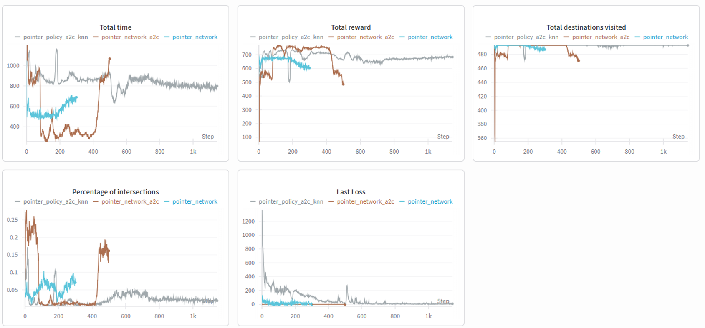
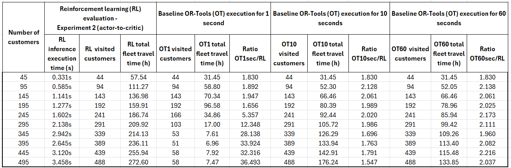

# Deep Learning for Logistics Optimization: Vehicle Routing with Reinforcement Learning

**UPC School — Postgraduate in Artificial Intelligence with Deep Learning**

**Authors:** Leonardo Torres, Tharini Moorthy, Alejandro Ortiz, Clara Gregori

**Supervisor:** Jorge Pueyo

**Date:** 18/3/2026

---

## Index

1. [Introduction](#introduction)
2. [Problem Statement](#problem-statement)
3. [Architecture](#architecture)
4. [Experiments](#experiments)
   - [Baseline results 1](#baseline-expected-results-1--kmeans--greedy)
   - [Baseline results 2](#baseline-expected-results-2--google-or--tools) 
   - [Exp 1: Pointer Network](#experiment-1-policy-pointer-network)
   - [Exp 2: A2C (Main)](#experiment-2-policy-pointer-network-a2c-main-branch)
   - [Exp 3: A2C + KNN](#experiment-3-policy-pointer-network-a2c-knn)
   - [ Evaluation, comparison to our baseline](#evaluation-comparison-to-our-baseline)
5. [Running the Code](#running-the-code)
6. [Final Conclusions](#final-conclusions)

---

## Introduction

This project tackles a real-world logistics optimization problem: **how do you plan daily delivery routes for a heterogeneous fleet of trucks, departing from multiple depots, to serve hundreds of customers — as cheaply and efficiently as possible?**

This problem is known as the **Multi-Depot Vehicle Routing Problem (MDVRP)**, a variant of the classical VRP that has been studied for decades. Classical solvers (e.g., OR-Tools, CPLEX) can find near-optimal solutions but are slow and expensive to run on large instances. **Deep Learning** offers a compelling alternative: train a model once, and at inference time generate good-quality routes in milliseconds.

Our final approach (`main` branch) combines:
- A **custom Gymnasium environment** that simulates the fleet routing process step by step.
- A **Pointer Network with Cross-Attention** that learns to select which truck to dispatch and which customer to visit next by "pointing" to destinations.
- A **policy gradient algorithm (A2C)** to train the policy from experience.


---

## Problem Statement

### Objective

Given a set of customers (delivery locations) and a fleet of trucks starting from one or more depots:

1. **Visit all possible customers** — every delivery must be completed, when restrictions allow it.
2. **Minimize total fleet travel time** — sum of all truck travel times.
3. **Respect the daily time limit** — each truck has a maximum working day (12 or 24 hours).

### Simplifications 

This project progressively scales from a minimal formulation to a richer multi-depot/multi-truck version:

| Feature | Current |
|---|---|
| Customers | Multiple (up to 500) |
| Trucks |  Multiple (up to 50) |
| Depots |  Multiple (up to 5) |
| Truck time window constraints |  Daily time limit per truck |
| Truck capacity restriction |  No (future work) |
| Truck access restrictions to costumers |  No (future work) |
| Customer time windows constraints |  No (future work)  |

### Data Instances

Three dataset sizes were created from representative or real geographic coordinates. `data_version_2` is a business real dataset scenario. Datasets are stored in folder `data/`.

| Version | Customers | Depots | Trucks | Time Limit |
|---|---|---|---|---|
| `data_version_3` | 10 | 1 | 2 | 12h |
| `data_version_1` | 50 | 1 | 5 | 24h |
| `data_version_2` | 500 (493 feasible deliveries) | 5 | 50 | 24h |

Each instance includes:
- GPS coordinates (lat/lon) for all nodes.
- Pairwise **travel time matrices** (in hours) between all nodes.
- Truck assignments to home depots.

---

## Architecture

### Environment (`TSPEnv`)

A Gymnasium-compatible environment that wraps the routing problem as a Markov Decision Process:

- **State**: For each step, the agent observes node coordinates, which nodes have been visited, current truck positions, truck elapsed times, and a full travel time matrix.
- **Action**: A joint `(truck_id, node_id)` pair — select which truck to dispatch and which customer it should visit next. A special `NO-OP` action allows a truck to retire when it is no longer efficient.
- **Episode end**: All customers visited or trucks not being able accept customers considering the daily time limit (truncation).

### Feature Engineering (Observation Space)

Each node is represented by a **10-dimensional feature vector**:

| # | Feature | Description |
|---|---|---|
| 1-2 | Coordinates | `(lat, lon)` of the node |
| 3 | `is_target` | 1 if customer, 0 if depot |
| 4 | `visited` | 1 if already delivered |
| 5 | `active_ratio` | Fraction of trucks still active (fleet context) |
| 6 | `avg_fleet_time` | Average elapsed time across all trucks |
| 7 | `max_fleet_time` | Maximum elapsed time across all trucks |
| 8 | `home_count` | How many trucks are based at this node |
| 9 | `min_dist_depot` | Minimum travel time from this node to any depot |
| 10 | `min_dist_truck` | Minimum travel time from any active truck to this node |


### Action Space

| Component | Type | Size (`dataset_2`) | Description |
| :--- | :--- | :--- | :--- |
| **Combined** | `MultiDiscrete` | 50 x 501 | **Factorized**: truck first, then node |
| └─ `truck_id` | `Discrete` | 50 | Which **truck** to dispatch |
| └─ `node_id` | `Discrete` | 501 + 1 | Which **node** to visit (last index = NO-OP) |


### Policy Network (`FactorizedFleetPolicy`)

```
Input: 10-dim features per node (** from observation space, see previous section)
         ↓
   Linear Embedding (→ 128-dim)
         ↓
   GNN Message Passing (1 step, KNN graph, k=15) - not in `main` branch
         ↓
   Global Graph Context (mean pooling)
         ↓
 ┌───────────────────────────────────┐
 │  TRUCK SELECTION (pointer head)   │
 │  Scores each truck via dot-product│
 │  attention + inactive truck mask  │
 └─────────────┬─────────────────────┘
               │
 ┌─────────────▼─────────────────────┐
 │  NODE SELECTION (pointer head)    │
 │  Scores each node via dot-product │
 │  attention + visited/time mask    │
 └───────────────────────────────────┘
         ↓
   Value Head (critic, for A2C)
```


**Key design choices:**
- **Factorized action selection**: truck and node are selected independently but jointly scored, keeping the action space manageable.
- **KNN graph (k=15), - for the last experiment, not in `main` branch-**: each node aggregates messages from its 15 nearest neighbors by travel time, encoding spatial locality into the embeddings.
- **Action masking**: infeasible actions (already-visited customers, time-limit violations) are masked to `-1e9` before softmax — the policy only learns from valid assignments.

### Training Algorithm: A2C (Advantage Actor-Critic)

```
For each episode:
  1. Roll out a full routing episode using the current policy
  2. Compute discounted returns G_t for each step
  3. Compute advantages: A_t = G_t - V(s_t)   (critic baseline)
  4. Actor loss:  L_actor  = -E[log π(a|s) · A_t]
  5. Critic loss: L_critic = MSE(V(s_t), G_t)
  6. Entropy bonus: L_ent  = -E[H(π)]         (exploration)
  7. Total loss = L_actor + 0.1 · L_critic + 0.07 · L_ent
  8. Gradient clipping (max_norm = 0.5)
  9. Cosine annealing LR schedule
```

### Reward Function

| Component | When | Formula |
|---|---|---|
| **Visit bonus** | Per customer visited | `≈ +0.87` (normalized) |
| **Distance penalty** | Per step | `-(travel_time - μ) / σ` |
| **Zone bonus** | Per step (if neighbor) | `+0.15` if next node is in KNN(prev_node) |
| **NO-OP penalty** | Per truck retired | `-1.5` |
| **Fleet time reward** | Terminal | `-(total_fleet_time - 400h) / 100`, clipped [-5, +2] |
| **Coverage penalty** | Terminal | `-0.87 × n_unvisited` |

All per-step rewards are **normalized** using the global mean and standard deviation of the travel time matrix, so the same reward scale applies across different data instances.

---

## Experiments

---

### Baseline expected results 1 — KMeans + Greedy

#### Hypothesis

A simple, non-learning approach combining geographic clustering with greedy nearest-neighbor routing can serve as a meaningful lower bound. Any RL agent that learns meaningful routing should beat this baseline on total time and coverage, especially on harder instances.

#### Experiment Setup

1. **Cluster customers** using K-Means (k = number of trucks), assigning each cluster to one truck's home depot.
2. Within each cluster, build a route using **greedy nearest-neighbor**: always go to the closest unvisited customer, subject to the daily time limit.
3. Evaluate: total customers visited, total fleet time, percentage of intersecting route segments.

No learning is involved — this is a deterministic, rule-based benchmark.

#### Results

| Instance | Customers visited | Total fleet time (h) | Route intersections |
|---|---|---|---|
| `data_version_1` (50 cust., 5 trucks) | **47 / 50** | 37.57 | 2.47% |
| `data_version_2` (500 cust., 50 trucks) | **493 / 500** | 415.41 | 1.46% |
| `data_version_3` (10 cust., 2 trucks) | **4 / 10** | 14.00 | 0.00% |

#### Conclusions

- The greedy approach achieves high customer coverage on larger instances (47/50 and 493/500) but distance could be covered more efficiently — it does not plan ahead globally.
- On the smallest instance (`data_version_3`, 2 trucks), performance drops significantly because the greedy strategy fails when the time limit is tight relative to the network density.
- **Route intersections (~1–2%)** reveal that greedy routing creates inefficient, crossing paths — a classic symptom of locally-optimal but globally-suboptimal routing.
- The RL agent must be able to deliver to all possible customers (not all are at a distance of <24 h by truck>), must beat ≤415.41h fleet time, and drive intersections toward 0%.

---

### Baseline expected results 2 — Google OR-Tools

#### Hypothesis

A simple, non-learning approach combining geographic clustering with greedy nearest-neighbor routing can serve as a meaningful lower bound. Any RL agent that learns meaningful routing should beat this baseline on total time and coverage, especially on harder instances.

#### Experiment Setup

1. Construct the routing problem using OR-Tools: Define a standard VRP with a single or multiple depots, vehicles, and distance/time cost evaluators.
OR-Tools allows setting search limits, such as global time limits, to keep the baseline deterministic and lightweight.
2. Generate routes using a built‑in OR-Tools first solution strategy for the dataset representative of our problem (`data_version_2`)
3. Evaluate: total customers visited, total fleet time, percentage of intersecting route segments.

#### Results

| Instance | Customers visited | Total fleet time (h) | Intersections (%) |
|---|---|---|---|
| `data_version_2` (500 cust., 50 trucks) | **493 / 500** | 119.60 | 0.00% |

#### Conclusions

- The Google OR-Tools baseline demonstrated that a deterministic, heuristic‑driven routing method can already achieve reasonably coherent routes with low computational overhead. It achived stable result after 5 minutes.
- **Route intersections (~0%)** reveals that the solutions is the optimal or close to it.
   The RL agent must be able to deliver to all possible customers within seconds to beat the >5 minutes running time of this baseline approach.

---

### Experiment 1: Policy pointer network
*It will be refered as PPN.*

#### Hypothesis

A minimal 10-customer, 2-truck instance is a good debugging and proof-of-concept environment. Once the code was running and results were the known expected ones then, the 500-customer, 50-truck dataset (`data_version_2`) was checked. A policy trained with vanilla REINFORCE should learn a reasonable policy and prove the environment and training loop are correct.

#### Experiment Setup

- **Data**: `data_version_2` — 500 customers, 5 depot, 10 trucks, 24h limit.
- **Algorithm**: REINFORCE (policy gradient, no value baseline).
- **Policy**: Linear embedding + pointer attention (no GNN message passing).
- **Hyperparameters**: `lr=1e-3`, `gamma=0.99`, `episodes=1000`, `embed_dim=128`.
- **Reward**: Visit bonus + distance penalty (no zone bonus, no fleet time terminal).

#### Results

| Experiment | Episodes | Total Reward | Total fleet time (h) | Customers visited | Intersections (%) | Last Loss |
| :--- | :---: | :---: | :---: | :---: | :---: | :---: |
| **PNN** | (results from 76) 500 | 684.08 | 466.34 | 493 | 0.04% | 8.6452 |


The PNN experiment achieved a reward of 684.08, visiting all 493 destinations with a 0.04% intersection rate. From Figure 1 we can see that the rewards are stable but start decreasing along with total destinations with increasing episodes.


*Figure 1: Training results comparison from W&B.*


#### Conclusions

- The minimal instance `dataset_1` confirms that the environment and training loop are functionally correct.
- The 10-customers instance is too small to draw generalizable conclusions but is essential for rapid iteration on architecture and reward design. Results are not shown, all metrics have significant noise.
- Without a critic, training is slow to converge. It could be expected that reward variance is high, but it is not observed in our case.


---

### Experiment 2: Policy pointer network + A2C (`main` branch)
*It will be refered as A2C*.

#### Hypothesis

The A2C agent (with critic baseline) should converge faster and achieve better solutions than REINFORCE. We expect the agent to learn geographic clustering behavior implicitly — grouping nearby customers into the same truck's route.

#### Experiment Setup

- **Data**: `data_version_2` — 500 customers, 5 depot, 50 trucks, 24h limit.
- **Algorithm**: A2C (actor + critic).
- **Policy**: `FactorizedFleetPolicy` with GNN message passing (KNN k=15).
- **Hyperparameters**: `lr=1e-3`, `gamma=0.99`, `episodes=1000`, `embed_dim=128`, `max_extra_steps=10`,`entropy_bonus=0.07`, `value_coef=0.1`
- **Reward**: Full reward (visit bonus + distance + zone bonus + terminal fleet time + coverage).

#### Results

| Experiment | Episode | Total Reward | Total fleet time (h) | Customers visited | Intersections (%) | Last Loss |
| :--- | :---: | :---: | :---: | :---: | :---: | :---: |
| **A2C (main branch)** | (results from 15) 500 | 768.88 | 254.02 | 493 | 0.01% | -0.0483 |

The A2C experiment visited the same destinations (493) as PPN method but the total fleet time was significantly decreased from  466 to 254 h in the best episodes for PPN and A2C, respectively. From Figure 1 we can see that the rewards are stable but start decreasing along with total destinations with over 400 episodes.


#### Conclusions

- The A2C agent with critic reduces increases rewards and final metrics significantly compared to vanilla REINFORCE.

---

### Experiment 3: Policy pointer network + A2C + KNN
*It will be refered as A2C+KNN*.

#### Hypothesis

The multi-depot, large-scale instance (data_version_2: 500 customers, 5 depots, 50 trucks) represents the target production scenario.

*Step 1:*
Construct a KNN graph where each node is connected to its N = 15 nearest neighbors. This effectively forms local clusters in which each node belongs to a group of nearby nodes (customers or depots) based on time-distance.

*Step 2:*
Build a GNN-based context using the edge_index derived from the KNN graph. Through message passing, each node aggregates information from its closest neighbors. Node features (derived from the observation space) are incorporated into the node embeddings during this process.

*Step 3:*
Apply a pointer network (dot product attention) that uses the GNN context to compute the probability distribution over possible truck selections and node destinations.

*Step 4:*
Compute the critic value to estimate the expected return of the current state.

The factorized fleet action space (select truck, then select node) should remain tractable even with 50 trucks and 500 customers.

Raw travel-time rewards differ drastically across data instances (short vs. long routes). If we use absolute reward values, the same hyperparameters will not transfer across instances. A **normalized reward** (zero-meaned, unit-variance via the time matrix statistics) should stabilize training across all three data versions with the same hyperparameter set.

Additionally, added a small **zone bonus** (+0.15) when a truck visits a node within the KNN neighborhood of its previous stop should encourage spatially compact, efficient routes.

#### Experiment Setup

- **Data**: `data_version_2` — 500 customers, 5 depots, 50 trucks, 24h limit.
- **Algorithm**: pointer network + A2C + KNN_GNN  with `FactorizedFleetPolicy`.
- **GNN**: 1-step message passing over KNN graph (k=15), built from the travel time matrix ( matrix to get time-distances from x => y )
- **Action masking**: inactive-trucks (trucks with completed work), visited-node and time-constraint mask (vectorized, no Python loop over trucks).
- **Hyperparameters**: `lr=1e-3`, `gamma=0.99`, `episodes=1000`, `embed_dim=128`, `max_extra_steps=10`,`entropy_bonus=0.07`, `value_coef=0.1`
- **Final rewards**: 

| Reward | Condition | Formula | Typical value |
|--------|---------------|---------|---------------|
| `visit_bonus` | Visit a target node | `(global_max - global_mean) / global_std` | +0.87 |
| `distance` | Every move | `-(travel_time - global_mean) / global_std` | −0.5 to −2.0 |
| `zone_bonus` | Visited node is KNN-neighbor of previous | `(global_mean - global_min) / global_std` | +0.15 |
| `noop_penalty` | Truck idles (NO-OP) | `-(global_max - global_min) / global_std` | −1.5 |
| `coverage` | Terminal: per unvisited node | `-(global_max - global_mean) / global_std` | −0.87 × N |
| `fleet_time` | Terminal: added to last reward | `-(fleet_time - 200) / 100 × unit` | −7.0 to +1.0 |

- **Observation**: 10-dim feature vector per node (see Feature Engineering (Observation Space) section).

#### Results

| Experiment | Episodes | Total Reward | Total fleet time (h) | Customers visited | Intersections (%) | Last Loss |
| :--- | :---: | :---: | :---: | :---: | :---: | :---: |
| **A2C + kNN** | (results from 520) 1500 | 683.32 | 798.71 | 493 | 0.02% | 9.1428 |

The A2C+KNN experiment visited the same destinations (493) as the other method but the total fleet time was significantly increased.  From Figure 1 we can see that the rewards are stable over 1000 episodes.


#### Conclusions

- The `data_version_2` instance is the hardest: 500 customers and 50 trucks imply a joint action space of 50 × 501 = 25,050 combinations per step.
- The factorized policy keeps this tractable by decomposing truck selection and node selection.
- The vectorized time-constraint masking (`_apply_time_constraints_v3`) is critical for performance at this scale — a Python loop over 50 trucks would be prohibitively slow.
- The GNN aggregates KNN neighborhood information in a single message-passing step, giving each node an awareness of its local cluster — which helps the policy avoid routing trucks to geographically distant customers.
- The zone bonus provides a soft inductive bias toward local routing without hardcoding any clustering step — the model learns to form geographic clusters organically.
- A fixed visit bonus (`≈+0.87`, equal to the normalized mean travel time) ensures that visiting any customer is always better than doing nothing, preventing the policy from collapsing to the trivial "retire all trucks immediately" solution.
- Since this approach is more complex, we observe that it requires more episodes than the previous ones (about 1000–1500) to converge. In addition, it does not always converge within the same number of hours we expect, but rather around ~100 hours
---

### Evaluation, comparison to our baseline

#### Training rewards comparison

Given realistic data (`dataset_3`) training across all three experiments progressed as expected, with rewards steadily increasing throughout the episodes. Although A2C+KNN was hypothesized to yield superior results due to its KNN-enriched observation space, initial findings indicate it did not outperform the standard A2C approach, as illustrated in **Figure 1**. All our models reached during training the available (due to time constraints, 24 hours for truck) customers, 493. The best total fleet time of our final accepted model was 254 hours (A2C experiment), versus 466 hours (PPN experiment) and 799 hours (A2C+KNN experiment).  Consequently, A2C experiment is used for the final performance comparison against the baseline results, and it is the stable approach on the `main` branch.

**Why A2C experiment might have outperformed A2C+KNN**

- Context Imbalance: Over-prioritizing local KNN features may have caused the model to lose the global fleet status necessary for overall route optimization.
- Increased Complexity: Higher parameter counts and a complex gradient path slowed convergence, likely leaving the model in a sub-optimal state compared to A2C experiment.
- Feature Redundancy: Existing distance-based features (e.g., min_dist_depot) already capture spatial data, making the KNN enrichment potentially redundant or noisy.
- Masking Dominance: Strong action masks for visited nodes and time constraints handle the primary routing logic, limiting the marginal benefit of advanced spatial representations.

#### Evaluation, comparison to `Baseline 2 approach, benchmark`

To evaluate our best-performing **A2C model**, we conducted inference (using frozen weights) on a realistic, unseen dataset with a **variable number of customers**.

With an execution time of just **2-3 seconds**, A2C significantly outperforms the benchmark in **computational speed**. A2C achieves full coverage (visiting all feasible customers) almost instantly, whereas OR-Tools requires more than 10 seconds to achieve full coverage for instances with more than 295 customers. This near-instant inference is critical for **offline applications on edge devices** with limited compute power.

However, in terms of **routing efficiency** (total fleet hours), OR-Tools consistently provides more optimized solutions across all time limits (1s, 10s, and 60s). As shown in the **'Ratio OT/RL'** columns, while the RL approach is superior for speed and coverage, OR-Tools remains more effective at minimizing global fleet costs when allowed more computation time.



*Figure 2: Training results comparison between A2C verus Google OR-Tools (Baseline 2 approach, benchmark).*


---

## Running the Code

### Requirements

- Python ≥ 3.9
- [Poetry](https://python-poetry.org/) (package manager)

### Installation

```bash
# Clone the repository
git clone <repository_url>
cd routing-model-2025

# Install all packages (monorepo with three interdependent packages)
poetry install
```

This installs `logisticsrl-lib`, `loader-lib`, and `common-lib` in develop mode.

### Training

Run with default settings (`data_version_2`, 1000 episodes, W&B enabled):

```bash
poetry run train
```

Run with custom hyperparameters:

```bash
poetry run train --lr 5e-4 --episodes 500 --data_dir data_version_2 --seed 42
```

Disable W&B logging (local run):

```bash
poetry run train --no-wandb
```

Available arguments:

| Argument | Default | Description |
|---|---|---|
| `--lr` | `1e-3` | Learning rate |
| `--episodes` | `1000` | Number of training episodes |
| `--embed_dim` | `128` | GNN/policy embedding dimension |
| `--seed` | `42` | Random seed |
| `--data_dir` | `data_version_2` | Dataset to use (`data_version_1/2/3`) |
| `--device` | auto | `cuda` or `cpu` |
| `--no-wandb` | — | Flag to disable W&B logging |

### Running the Baseline Greedy Benchmark

```bash
poetry run benchmarks --data_dir data_version_2
```

This runs the KMeans + Greedy baseline and saves:
- Console output with per-cluster route summaries.
- `checkpoints/clusters_visualization.png` — scatter plot of customer clusters.
- `checkpoints/viz_kmeans_and_greedy_<data_dir>.html` — interactive route map.

### Running the SOTA (Google OR-Tools)

```bash
poetry run benchmarks_2
```

This runs the SOTA OR-Tools

---

## Final Conclusions

This project demonstrates that **Reinforcement Learning can learn meaningful routing policies for multi-depot, multi-truck VRP instances** using a combination of:

1. **Graph Neural Networks** for spatially-aware node representations.
2. **Factorized action selection** to keep the action space tractable.
3. **Action masking** to guarantee feasibility without penalizing hard constraints in the reward.
4. **Normalized, shaped rewards** to stabilize training across different instance scales.

**Key lessons learned:**

- **Reward engineering is critical.** The routing task has sparse, delayed signals (most reward comes at episode end). Introducing per-step signals (visit bonus, distance, zone bonus) was essential for learning to take off.
- **Normalization enables transfer.** Normalizing rewards by the time-matrix statistics allows the same hyperparameter configuration to work across instances with very different travel-time scales.
- **The Google OR-Tools is a strong bar.** It achieves all deliverable customers (493/500) within 5 minutes of compute time. Beating it in total fleet time requires the RL agent to plan globally — which is precisely what the GNN enables.


**Open challenges and future directions:**

- **Customer constraints**: The full problem includes additional restrictions on truck access to certain customers. Due to road access limitations, not all trucks can reach all customers.
- **Capacity constraints**: Adding real truck capacity constraint is another major constraint to incorporate.
- **Time windows**: Adding delivery time windows per customer is another major constraint to incorporate.
- **Generalization to unseen instances**: The current model is trained on fixed instances. Training on randomly generated instances (curriculum learning) would improve generalization.
- **Improving Experiment 3**: Experiment 3 could implement a multi-layer GNN architecture (e.g., GAT) using edge costs and dynamic graph updates to better capture spatial dependencies as nodes are visited. Additionally, integrating local zone-based attention with global context pooling will allow the model to balance localized route efficiency with global fleet optimization.


---

## References
### Neural Routing Foundations

- Kwon et al. (2020). *POMO: Policy Optimization with Multiple Optima for Reinforcement Learning.* NeurIPS. https://proceedings.neurips.cc/paper/2020/hash/f231f2107df69eab0a3862d50018a9b2-Abstract.html
- Kool et al. (2022). *Deep Policy Dynamic Programming for Vehicle Routing Problems.* CPAIOR. https://wouterkool.github.io/pdf/paper-dpdp-final.pdf
- Hottung & Tierney (2022). *Efficient Active Search for Combinatorial Optimization Problems.* ICLR. https://openreview.net/forum?id=nO5caZwFwYu

### Multi-Depot VRP with GNNs

- Zhang et al. (2023). *Graph Attention Reinforcement Learning with Flexible Matching Policies for Multi-Depot Vehicle Routing Problems.* Physica A. https://ui.adsabs.harvard.edu/abs/2023PhyA..61128451Z/abstract
- Zong et al. (2024). *Multi-Type Attention for Solving Multi-Depot Vehicle Routing Problems.* IEEE. https://ieeexplore.ieee.org/document/10568457
- Gama et al. (2024). *DeepMDV: Learning Global Matching for Multi-Depot Vehicle Routing Problems.* arXiv:2411.17080. https://arxiv.org/html/2411.17080v2

### Action Masking & Feasibility

- Bono et al. (2023). *NeuOpt: Learning to Improve Feasible Solutions.* NeurIPS. https://proceedings.neurips.cc/paper_files/paper/2023/file/9bae70d354793a95fa18751888cea07d-Paper-Conference.pdf
- Liu et al. (2024). *PARCO: Learning Parallel Autoregressive Policies for Efficient Multi-Agent Combinatorial Optimization.* arXiv:2409.03811. https://arxiv.org/html/2409.03811v1

### Surveys

- Bogyrbayeva et al. (2022). *A Survey on Machine Learning Methods for the Vehicle Routing Problem.* IEEE Transactions on Intelligent Transportation Systems. https://ieeexplore.ieee.org/document/10379532
- Liu et al. (2025). *Reinforcement Learning for the Vehicle Routing Problem: Methodologies, Applications, and Research Outlook.* Arabian Journal for Science and Engineering, Springer. https://link.springer.com/article/10.1007/s13369-025-10744-3

### Other resources

- https://developers.google.com/optimization/routing
