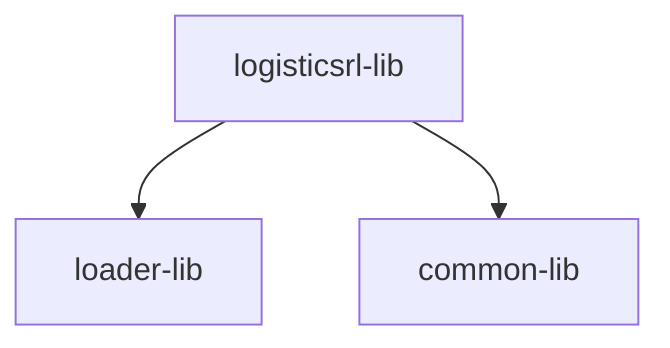

# Logistics RL: Routing Optimization POC

This repository contains a modular Reinforcement Learning framework designed to solve Routing Problems (like TSP and VRP) using an Attention-based Pointer Network.

## Project Structure
```
routing-model-2025/
├── checkpoints/ # Trained model weights
├── data/ # Input and output data
├── notebooks/ # Experimentation Jupyter notebooks
├── packages/
│ ├── logisticsrl-lib/
│ │ └── src/logisticsrl_lib/
│ │ ├── main.py # Main training script
│ │ ├── configs/
│ │ │ └── config.py # Configuration and arguments
│ │ └── reinforcelearning/
│ │ ├── agent.py # RL agent logic
│ │ ├── policy.py # Policy architecture
│ │ └── tsp_env.py # Gymnasium environment
│ ├── loader-lib/
│ │ └── src/loader_lib/
│ │ └── data_loader.py # Data loading and processing
│ └── common-lib/
│ └── src/common_lib/
│ ├── evaluation_utils.py # Evaluation utilities
│ └── visualization_utils_plotly.py # Route visualization
├── run_experiments.py # Experiment/grid search orchestrator
├── requirements.txt # Base environment dependencies
├── pyproject.toml # Poetry configuration and scripts
├── README.md # Main documentation
└── wandb/ # W&B experiment logs
```
---


## Subproject Dependencies

Below is a simple diagram illustrating the dependencies between the subprojects:



## Installation & Setup


1. 🚀 **Install Poetry**
   Poetry is the recommended dependency manager for this project. You can install it by following the official documentation:
   - **Mac/Linux:**
     ```bash
     curl -sSL https://install.python-poetry.org | python3 -
     ```
   - **Windows (PowerShell):**
     ```powershell
     (Invoke-WebRequest -Uri https://install.python-poetry.org -UseBasicParsing).Content | python -
     ```
   Poetry simplifies dependency management and ensures consistent environments across systems. More details and alternative methods: [Poetry Installation Guide](https://python-poetry.org/docs/#installation).

2. 📦 **Install Dependencies**
   Use the provided requirements file to set up your environment. Navigate to each package directory and install dependencies using Poetry:
   ```bash
   cd packages/logisticsrl-lib && poetry install
   cd ../loader-lib && poetry install
   cd ../common-lib && poetry install
   ```
   This ensures that all required libraries and tools are installed for each module.

3. 🔄 **Update Dependencies After Adding a New Package**
   If you add a new dependency to any of the Poetry-managed packages, update the lock file and install the new dependency by running:
   ```bash
   poetry update
   ```
   Execute this command inside the corresponding package directory (e.g., `packages/logisticsrl-lib`). Each subproject contains a `pyproject.toml` file, which defines its dependencies and configuration. This keeps your environment up-to-date and consistent.

4. 🏃 **Run the Training Script with Poetry**
   To execute the main training script using Poetry's script system, run:
   ```bash
   poetry run train
   ```
   This command invokes the `train` function defined in `main.py` of the `logisticsrl-lib` package. Poetry ensures the correct environment and dependencies are used during execution.

5. **Poetry, virtual environments, and Visual Studio Code**
   Poetry automatically creates and manages a virtual environment (venv) for each project. To use this venv in Visual Studio Code:
   - Run `poetry env info --path` inside your package directory to get the path to the Poetry-managed venv.
   - In VS Code, open the Command Palette (`Ctrl+Shift+P` or `Cmd+Shift+P`), search for "Python: Select Interpreter", and choose the interpreter that matches the path shown by Poetry.
   - This ensures that scripts and notebooks use the correct environment with all dependencies installed by Poetry.

6. **Initialize Weights & Biases (Optional)**
   This project is integrated with W&B for real-time experiment tracking.
   ```bash
   wandb login
   ```

---
